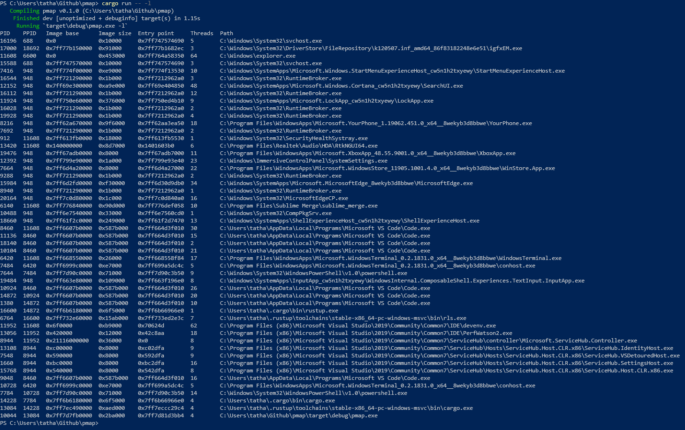

### Process map

### Why another process memory mapping tool?
 - education purpose
 - windows API programming in Rust is doable
 - fun

### References
 - [C# How to Scan a Process' Memory](https://codingvision.net/security/c-how-to-scan-a-process-memory): begin with this one, because all user-mode process memory scanning are more or less the same
 - [x64dbg](https://github.com/x64dbg/x64dbg/blob/development/src/dbg/memory.cpp): read it to be sure you didn't forget anything important
 - [VMMap](https://james-ross.co.uk/projects/vmmap): at which I've stolen some ideas ;)
 - [ProcessHacker](https://github.com/processhacker/processhacker/blob/master/KProcessHacker/process.c): kernel-mode magics that I still cannot understand :(
 - Others: [XenoScan](https://github.com/nickcano/XenoScan), [HyperScan](https://guidedhacking.com/threads/hyperscan-fast-vast-memory-scanner.9659/), [pe-sieve](https://github.com/hasherezade/pe-sieve)
